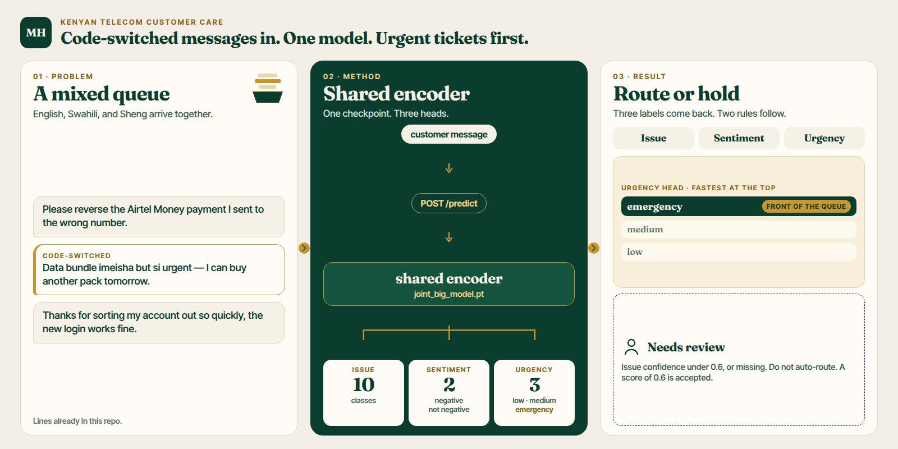
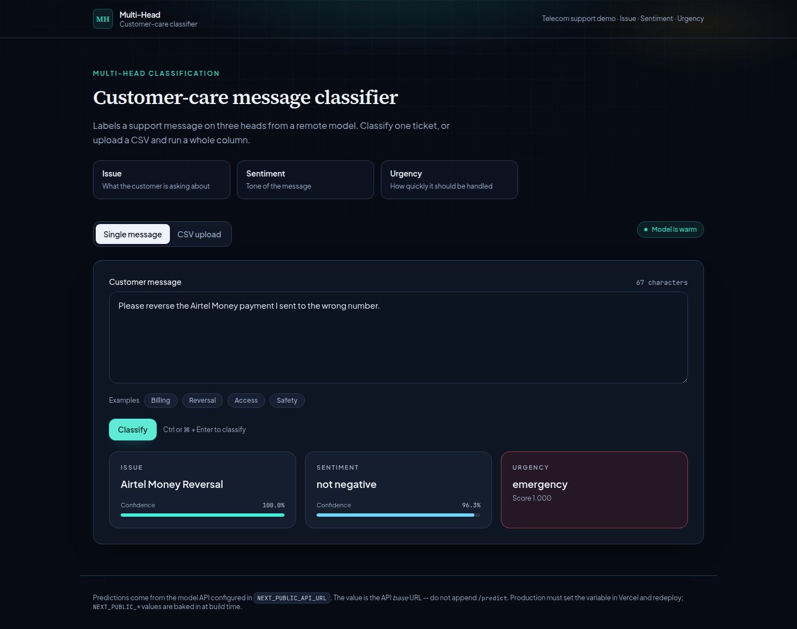
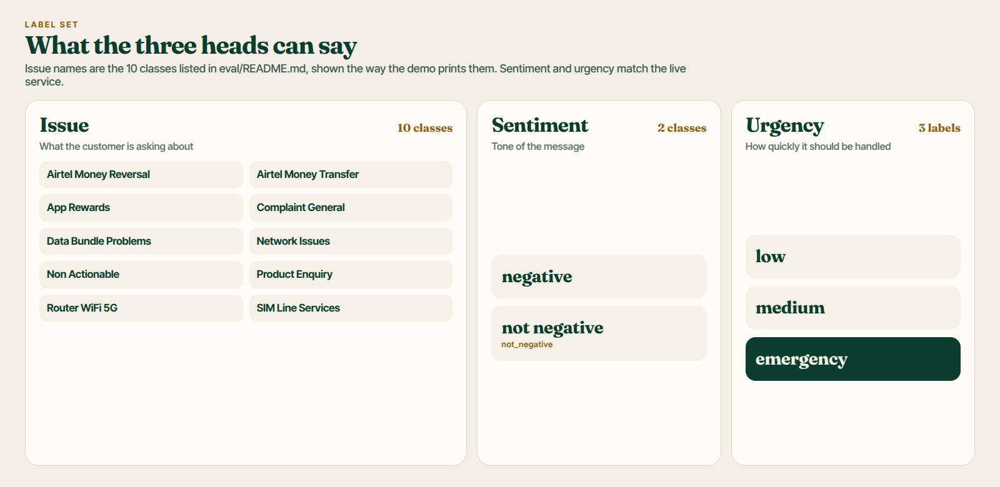

# Multi-head triage for code-switched customer-care messages



[](https://github.com/ChristopherKiokoStrathmore/MULTI-HEAD-/actions/workflows/ci.yml)
[](LICENSE)

Kenyan telecommunications customer care receives short messages that mix English, Swahili, and Sheng. This project triages each message on three heads: **issue**, **sentiment**, and **urgency**, and it holds a ticket for a person when the issue head is not confident enough to auto-route.

Live demo: [https://multi-head.vercel.app](https://multi-head.vercel.app)



The screenshot was captured with headless Playwright against the live site on 1 October 2026, using the Reversal example already on the page. It is a picture of the demo, not an evaluation table.

## Demo


Recorded in the browser on the live site on 1 October 2026, using the Reversal example already on the page. It is a picture of the demo, not an evaluation table.

## Problem

A support queue still has to answer three questions about every ticket: what the customer is asking about, how the message feels, and how fast it should move. The messages are code-switched. The live `POST /predict` schema, read from the deployed OpenAPI document on 1 October 2026, describes the body field as a raw customer message (`en / sw / sheng`).

This repository is the public demo of that triage step, plus a live-API eval harness. It does not contain training data or weights.

## Model

The paper title names a multi-task transformer. What this repository and the live service actually expose is a three-head classifier:

| Head | Question it answers | What the live service reports |
| --- | --- | --- |
| Issue | What the customer is asking about | 10 classes (`issue_classes` on `GET /health`) |
| Sentiment | Tone of the message | 2 classes (`sent_classes` on `GET /health`) |
| Urgency | How quickly it should be handled | `low`, `medium`, `emergency` |

`GET /health` on 1 October 2026 returned:

```json
{
  "status": "ok",
  "model_loaded": true,
  "device": "cuda",
  "checkpoint": "/data/ckpt/joint_big_model.pt",
  "issue_classes": 10,
  "sent_classes": 2,
  "urgency_labels": ["low", "medium", "emergency"]
}
```

That payload is from `https://thechriskioko--threehead-serve-server-fastapi-app.modal.run/health`. The checkpoint path is the service's own string. The weights are not in this repo.




The issue names above are the display form from `lib/format.ts`: underscores become spaces. Sentiment and urgency match `GET /health` and [eval/README.md](eval/README.md).

Human review sits on the issue head. `ISSUE_ABSTAIN_THRESHOLD` in `lib/trust.ts` is `0.6`. Below that threshold, or when issue confidence is missing, the UI shows **Needs review / do not auto-route** and still shows the top guess. A score of exactly 0.6 is accepted. CSV rows use the same rule (`issue_needs_review` in the download). The live API does not return a second-best issue, so the UI does not invent one.

A pretrained backbone name is not written in this repository, and it is not in the live health payload. The paper cited below is where the model write-up lives. Training location is in [Training code and model](#training-code-and-model).

## Results

Held-out model metrics are not stored in this repository. They are reported in the paper (Kioko 2026, 'Signal in the Noise: A Multi-Task Transformer for Triaging Code-Switched Messages in Kenyan Telecommunications', submitted for publication).

A separate file, [reports/eval_smoke.md](reports/eval_smoke.md), records one run of the live-API harness on synthetic smoke data. Those figures are a harness check. They are not the paper's results and they are not a model-quality claim.

## Live demo

Open [https://multi-head.vercel.app](https://multi-head.vercel.app).

The page is a Next.js frontend with no model logic of its own. It reads `NEXT_PUBLIC_API_URL` in `lib/api.ts` and calls `GET /health`, `POST /predict`, and `POST /predict_batch`. One page covers a single message and a CSV batch. How to set the URL on Vercel, and how CORS and cold starts behave, is in [docs/DEPLOY.md](docs/DEPLOY.md).

## Training code and model

Training is outside this repository. [eval/README.md](eval/README.md) says this repo has no local GPU and no training code, and that training lives on Chris's machine, in the Modal training codebase. Retraining (loss weights, new labels) happens there. After a new checkpoint is deployed, point this harness at the new API.

This repository does not record a URL for that training codebase, so none is linked here.

What is in git:

- the demo UI under `app/` and `components/`
- the abstain rule in `lib/trust.ts`
- the live-API scorer in `eval/`

## Run the demo locally

```bash
npm install
cp .env.example .env.local     # then set NEXT_PUBLIC_API_URL to the API base
npm run dev                    # http://localhost:3000
```

`NEXT_PUBLIC_API_URL` is the API base only. Do not append `/predict`, `/health`, or `/predict_batch`. Trailing slashes are stripped. If it is unset, the page still renders and classify stays disabled.

`sample-messages.csv` at the repo root is for CSV mode.

```bash
npm run build          # production build
npm run start          # serve the production build locally
npm test               # eval harness unit tests (no live API)
npm run eval:smoke     # score the synthetic fixture against the live API
npm run eval:smoke:ci  # CI equivalent: JSON report, fail if smoke gates fail
npm run eval -- --csv /path/to/heldout.csv
```

The last command is how you score a real labeled file. Schema and flags are in [eval/README.md](eval/README.md).

## Evaluation harness

`eval/` scores a labeled CSV against the live API (`POST /predict_batch`). It does not train a model.

- Schema, flags, and gates: [eval/README.md](eval/README.md)
- Fixture: `eval/synthetic-heldout.smoke.csv` is synthetic smoke data, not production gold, and it has no customer PII
- Floors: `eval/gates.smoke.json` checks that the API is up, scoring finished, and urgency did not collapse entirely. Those floors are harness health, not a quality bar
- Abstain default: `0.6`, the same constant as the UI

Urgency reporting includes accuracy and macro-F1, plus emergency recall, false-emergency rate, and quadratic-weighted Cohen's kappa on `{low, medium, emergency}`.

The eval API base is the first non-empty value among `--api-url`, `MULTIHEAD_API_URL`, `NEXT_PUBLIC_API_URL`, and the known Modal host. The Next.js app still reads only `NEXT_PUBLIC_API_URL`.

## Notebooks

[notebooks/README.md](notebooks/README.md) is a local Python path for two checks this Node app does not run: a frozen `Davlan/afro-xlmr-large` baseline against the deployed three-head service, and an emoji-tokenization audit of that tokenizer. The notebooks use the same label columns and the same metric definitions as [eval/README.md](eval/README.md). They do not add training code, and they do not replace `npm run eval`. Customer spreadsheets and `.pt` weights stay out of git.

## CI

Workflow: [`.github/workflows/ci.yml`](.github/workflows/ci.yml)

On every push and pull request to `master` or `main`, two jobs run in parallel:

| Job | What | Calls Modal |
| --- | --- | --- |
| Frontend build | `npm ci`, `npm test`, notebook metric tests, `npm run build` | no |
| Live eval smoke (Modal) | `npm run eval:smoke:ci`, then upload `eval-smoke-report.json` | yes |

A Modal outage or a failed smoke gate fails the eval job. The frontend job can still pass on its own. Branch protection chooses whether both checks are required to merge.

Keep any later human-gold CSV out of git. The pattern is in [eval/README.md](eval/README.md).

## Errors

The banner shows the failure. It does not hide it.

| Failure | What is displayed |
| --- | --- |
| Non-200 response | HTTP status, method, URL, and response body |
| Timeout | Which URL timed out, and after how many seconds |
| Network or CORS | The browser message and the likely causes. Header setup is in [docs/DEPLOY.md](docs/DEPLOY.md). |
| Non-JSON body | The status plus the first 400 characters of the body |
| Misaligned batch | How many predictions came back, and how many rows were sent |
| `NEXT_PUBLIC_API_URL` unset | How to set it locally and on Vercel |

In CSV mode, rows classified before a failure are kept and stay downloadable.

## Project structure

```
.
├── assets/
│   ├── architecture.png      # browser, checkpoint, three heads
│   ├── demo.gif              # live Reversal classification
│   ├── hero.png              # problem, method, result
│   ├── labels.png            # issue, sentiment, and urgency names
│   └── social-preview.png    # 1280x640 social card
├── app/
│   ├── globals.css           # Tailwind v4 entry
│   ├── layout.tsx            # root layout
│   └── page.tsx              # single page
├── components/               # classify UI, review banner, CSV batch
├── lib/
│   ├── api.ts                # the only place NEXT_PUBLIC_API_URL is read
│   ├── trust.ts              # ISSUE_ABSTAIN_THRESHOLD (0.6)
│   ├── types.ts
│   ├── format.ts
│   ├── examples.ts
│   └── urgency.ts
├── eval/                     # live-API scorer, smoke fixture, smoke gates
├── notebooks/                # local baselines; see notebooks/README.md
├── docs/
│   ├── DEPLOY.md             # Vercel, CORS, cold starts
│   └── live-demo.png         # screenshot of the live demo
├── reports/
│   └── eval_smoke.md         # synthetic smoke run, not model quality
├── .github/workflows/ci.yml
├── sample-messages.csv
├── LICENSE
└── package.json
```

## Display details

- Urgency colours: `low` is grey, `medium` is amber, `emergency` is red. Any other label is drawn with a dashed border and no urgency colour.
- Confidence under Issue and Sentiment is a percentage. The API may send 0-1 or 0-100. Both are normalised.
- Below the issue threshold the top guess stays on screen and is marked as a guess, not a routing decision.
- `urgency_score` is shown under Urgency when the API returns it, and omitted when it does not.
